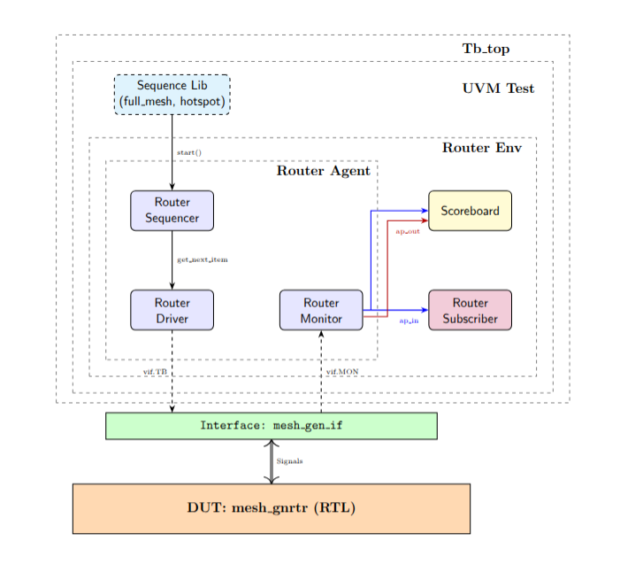

# Proyecto 2 Verificación Funcional de Circuitos Integrados.
## Lista de Features

| Categoría          | Feature                                 |
| ------------------ | --------------------------------------- |
| **Topología**      | Generación de malla (`ROWS`, `COLUMNS`) | 
| **Ruteo**          | Dirección por modo (`mode`)             | 
|                    | Broadcast                               |
|                    | Direccionamiento                        | 
| **Comunicación**   | Transferencia de paquetes               | 
|                    | Push/Pop handshake                      | 
|                    | Pending/Idle signals                    | 
| **Arbitraje**      | Router arbiter                          | 
| **FIFO**           | Overflow/underflow                      |
| **FSM control**    | Transiciones correctas                  | 
| **Escalabilidad**  | Tamaño variable                         | 


## Ambiente a desarrollar



<p align="center">

<div align="center">
 Figura 1. Diagrama del ambiente a implementar
</div>
</p>

## Comandos para ejecutar
En la carpeta de src puede correr el comando
```sh
make help
```
Y se desplegarán los comandos que puede utilizar para compilarlo, ejecutarlo o utilizar distintas opciones de test.
